# eGroceryAssistant 

## Project Page
Please visit the project page for additional details at [https://grocery-assistants.web.app/](https://grocery-assistants.web.app/)

## Project Members and Affiliations
This project was developed within the Paul G. Allen School for Computer Science and Engineering at the University of Washington as part of the capstone Software Design to empower Underserved Populations. Mariam Mayanja, Geovani Castro, and [Preston Jiang](https://homes.cs.washington.edu/~prestonj/) co-designed the project with help from needs experts such as contacts from the Department of Health and Human resources and WIC participants who will remain nameless for sake of anonymity. 

The design of UX/UI elements were adopted from the following:

* Template Name: eStartup
* Template URL: https://bootstrapmade.com/estartup-bootstrap-landing-page-template/ 
* Author: BootstrapMade.com 
* License: https://bootstrapmade.com/license/ 

## Project Goals and Mission

This project was designed and developed to address food insecurity created in marginalized communities, specifically food insecurity faced by WIC participants, by panic buying that arose from the COVID-19 pandemic. 

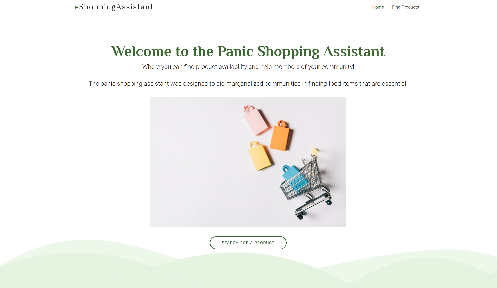

There were two major goals defined in this project. We wanted to (1) make it easier for users to find and identify stores where the WIC eligible food they would like to purchase is in stock and (2) allow users to update store quantities in an easy and fast way. 


## Project Development

Overall, our project aims to make shopping for WIC-eligible food products easier during public emergencies by providing product availability estimates using crowdsourced data. Our web application recommends/ranks WIC vendors to the users based on their location and the estimated amount of the product of interest in store, calculated from user feedback. In the following section, we first give an overview of the project structure, then elaborate on each part of the project development and how to configure them for reproducibility. 

### Overall Project Structure 

The following flow chart gives an overview of the project infrasture and the functional flow of the application:

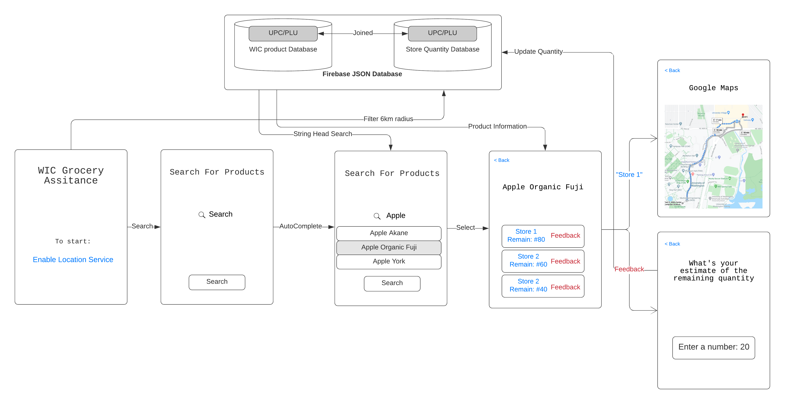

The project file directory is structured as follows (`[Description]` denotes the purpose of the file/folder): 

```
├── 404.html
├── Data_Exploration [Data preparation & preprocessing]
│   ├── create_quantity_csv.ipynb
│   ├── edit_database.ipynb
│   └── try_loading_csv.ipynb
├── GroceryAssistants.iml [Firebase configuration] 
├── Readme.md
├── Scraping [Data preparation & preprocessing]
│   └── wic_stores.ipynb
├── assets [Website assets, css, styles, etc.] 
│   ├── css
│   ├── img
│   ├── js
│   └── vendor
├── build_public.sh [Shell command for deployment] 
├── data [Database files]
│   ├── quantities.csv
│   ├── quantities.json
│   ├── stores.csv
│   ├── wic_database.csv
│   └── wic_database_cleaned.csv
├── figures [Markdown figures]
│   └── flowchart.png
├── firebase.json [Firebase configuration]
├── index.html [Webpage]
├── public [Firebase deployed version]
│   ├── 404.html
│   ├── assets
│   ├── forms
│   ├── index.html
│   └── scripts
├── scripts [Javascript backend]
│   └── main.js
```

The main libraries & services we used include:
* [Pandas](https://pandas.pydata.org/) for easy tabular data exploration in Python
* [BeautifulSoup4](https://www.crummy.com/software/BeautifulSoup/bs4/doc/) for scraping information from websites in Python
* [Firebase](https://firebase.google.com/) as the backend for reading/writing JSON entries and deployment
* [HERE Maps](https://www.here.com/) for calculating driving locations 

### Data Preprocessing & Uploading (`Data_Exploration`)

Before uploading the database to Firebase, we first preprocessed the acquired data file for better organizations to suit our application. In addition, we used web scraping techniques in Python to acquire a list of WIC food vendors from the [King County website](https://www.kingcounty.gov/depts/health/child-teen-health/women-infants-children.aspx#locations). Because Firebase free-tier plan only allows **one** database to be uploaded, the last step is to combine the food product database with the store & quantity database into one. This inevitably increases the size of the database and leads to slow performance in searching. 

Steps in detail (`[file/folder name]` denotes the file/folder that implements the function decribed):

1. Data cleaning (`Data_Exploration/edit_database.ipynb`): We cleaned and preprocessed some data to make the category information more readable and easy to search (For example, we grouped all “Infant” related product categories such as “Infant - Meats” and “Infant - Vegetable” to the large “Infant” category, with “Meats” and “Vegetable” being the subcategories
2. Web scraping (`Data_Exploration/create_quantity_csv.ipynb`): We scraped the list of King County WIC vendor (grocery stores) from the website above and randomly initialized the quantity of each product as a starting value. 
3. Database joining (`Data_Exploration/create_quantity_csv.ipynb`): We joined the food product information database and the store & quantity database into one. The output database is `data/quantities.csv` and `data/quantities.json`, which is the required format for Firebase.

The final database structure is shown as follows (in table format for readability, uploaded as JSON entries):
 UPC_PLU     | Category           | Subcategory              | Description                                          | Size | Unit | Store                    | Location                                                                  | Latitude   | Longitude  | Quantity | Last_Updated 
-------------|--------------------|--------------------------|------------------------------------------------------|------|------|--------------------------|---------------------------------------------------------------------------|------------|------------|----------|--------------
 72220110616 | Bread/Whole Grains | Bread - 100% Whole Wheat | Abiqua Farms 100% Whole Wheat Bread 24 oz            | 24   | OZ   | Albertsons #2410         | https://www.google.com/maps/place/13050%20Aurora%20Avenue%20N.,%20Seattle,%20WA | 47.7238643 | -122.34304 | 21       | None         
 17072000258 | Bread/Whole Grains | Bread - 100% Whole Wheat | Cascade Pride 100% Whole Wheat Hamburger Buns   14oz | 14   | OZ   | Hilltop Red Apple Market | https://www.google.com/maps/place/2701%20Beacon%20Ave.%20S.,%20Seattle,%20WA    | 47.5790532 | -122.31292 | 19       | None         

To reproduce the results, simply run all the Jupyter notebooks mentioned above in order. 

The last step is to upload the JSON file to Firebase's realtime database. The following steps provide intrsuctions on this process:

1. Follow the instructions [here](https://firebase.google.com/docs/web/setup) to set up a Firebase project.
2. Go to the Firebase project console.
3. Select `Database` under the `Develop` navigation bar on the left, and then `Realtime Database` in the main page.
4. Select `Import JSON` and choose `data/quantities.json`. Wait until the upload completes.
5. Go to `Rules` and paste the following to allow read/write access and use `Description` as the index key for searching. 
```
{
  "rules": {
    ".read": true,
    ".write": true,
    "data": {
      ".indexOn": ["Description"]
    }
  }
}
```
This concludes the data cleaning and Firebase database setup. We introduce the project backend (main logic) next.

### Project Backend and Error States (`scripts/main.js`)

The main functionalities of the backend include:

* Acquiring users' geolocation:
  This is promptedly immediately after the user opens the website, which is needed for store ranking later.
* String search to match product description: 
  The backend takes user input and returns a list of relevant food product based on the descrption. Unfortunately, the official documentation of Firebase indicates that [full-string search is not supported in Firebase](https://firebase.google.com/docs/firestore/solutions/search). Thus, we are limited to matching the *beginning* of the descrption based on the user input (e.g. "Whole Wheat Bread" 
  will be returned by a search with "Whole", not "Wheat"). 
* Autocomplete:
  Because of this searching limitation, the course staff suggested that having an autocomplete feature when the user types in the search bar would be useful to receive immediate feedback. We took [this implementation](https://www.w3schools.com/howto/howto_js_autocomplete.asp) of an autocomplete search bar and modified it so that every keyboard input triggers a search query in the Firebase database.
* Store ranking: 
  Once the user select a product from the previous step, the backend takes the input and searches for all eligible stores. First, all stores outside of six kilometers (by driving) from the user are excluded. To implement this functionality, we used HERE Maps API to calculate the shortest driving location between the user and each store. For those within the radius, we rank the stores by the quantity of products left and then present the information for the top four stores. We also display a map snippet of the stores recommended with markers.
* User feedback:
  If the user finds the quantity we provided about the product at a specific store is not accurate, s/he has the option to give us feedback through the input box. Once the user selects "Update", the JSON entry in our database is updated in realtime.

The error states include:

* Product not found: If no products were found by the user's search. With the autocomplete functionality that allows the user to choose a specific product, this should be a rare error state. A red text message is displayed.
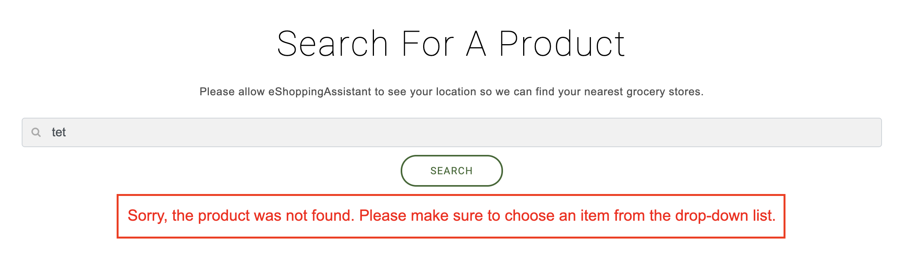
* No store within radius: Currently, our database only contains stores in Seattle, WA. If the user is outside of the city or in an area where there are no stores available within 5 km, it will be an error state. A red text message is displayed. 
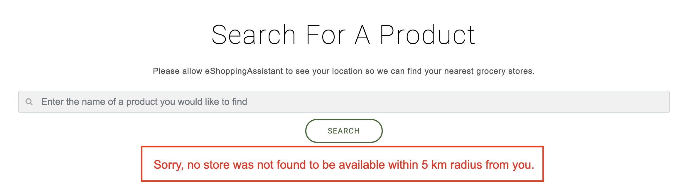
* Unreasonable feedback value: The input box for quantity feedback is restricted such that no negative values are allowed. 

### Project Deployment (`public/`)

We use Firebase to deploy our website onto their server. First, follow the steps [here](https://firebase.google.com/docs/hosting/deploying) to set up the Firebase command line tools. Then follow the steps below:

1. Run `./build_public.sh` to prepare for the deployment folder
2. Run `firebase init`, and select `❯◉ Hosting: Configure and deploy Firebase Hosting sites`. 
```
     ######## #### ########  ######## ########     ###     ######  ########
     ##        ##  ##     ## ##       ##     ##  ##   ##  ##       ##
     ######    ##  ########  ######   ########  #########  ######  ######
     ##        ##  ##    ##  ##       ##     ## ##     ##       ## ##
     ##       #### ##     ## ######## ########  ##     ##  ######  ########

You're about to initialize a Firebase project in this directory:

  /Users/lpjiang/Courses/GroceryAssistants

Before we get started, keep in mind:

  * You are initializing in an existing Firebase project directory

? Which Firebase CLI features do you want to set up for this folder? Press Space to select features, then Enter to confirm your choices.
 ◯ Database: Deploy Firebase Realtime Database Rules
 ◯ Firestore: Deploy rules and create indexes for Firestore
 ◯ Functions: Configure and deploy Cloud Functions
❯◉ Hosting: Configure and deploy Firebase Hosting sites
 ◯ Storage: Deploy Cloud Storage security rules
 ◯ Emulators: Set up local emulators for Firebase features
```
3. Select default (`public`) for the deployment folder and then answer `No` to all other questions:
```
=== Project Setup

First, let's associate this project directory with a Firebase project.
You can create multiple project aliases by running firebase use --add,
but for now we'll just set up a default project.

i  .firebaserc already has a default project, using grocery-assistants.

=== Hosting Setup

Your public directory is the folder (relative to your project directory) that
will contain Hosting assets to be uploaded with firebase deploy. If you
have a build process for your assets, use your build's output directory.

? What do you want to use as your public directory? public
? Configure as a single-page app (rewrite all urls to /index.html)? No
? File public/404.html already exists. Overwrite? No
i  Skipping write of public/404.html
? File public/index.html already exists. Overwrite? No
i  Skipping write of public/index.html

i  Writing configuration info to firebase.json...
i  Writing project information to .firebaserc...

✔  Firebase initialization complete!
```
You should see something like above.

4. Run `firebase serve` and `firebase deploy` to deploy the website.

## Limitations & Future Directions

We have encountered a few limitations due to time, technical ability, and data constraints. First and foremost, there is no preexisting data that we have access to which will allow us to start pre-populating the crowdsourced data. In a meeting with the Department of Health, Mariam found that there is an API of all past WIC purchases that include location, a timestamp, and even who made the purchase. While this data would be tremendously beneficial to our database, it provides an ethical concern for the Department of Health. Since this data is so rich, it could be easily exploited by big companies like Nestle or Kroger to boost sales. Therefore, we do not have any pre-existing data to aggregate our crowdsourcing platform. 

Most of the technical limitations our application faces are due to the free-tier plan of Firebase. As mentioned above, full-text string search is not supported, and the few alternatives suggested by Firebase are also paid services. In addition, the free-tier Firebase plan only allows one database to be uploaded. This forced us to put all of the information together joinly in one table, which drastically increased the number of entries to be searched each time.  

With more resources available, future endeavors can be focused on (1) more efficient & flexible searching with multiple databases; (2) more options or filters to limit the number of entried returned; (3) supporting a larger area of stores and allowing the user to provide information on products that do not yet exist in our database.

## Storyboard 

### Scenario 1
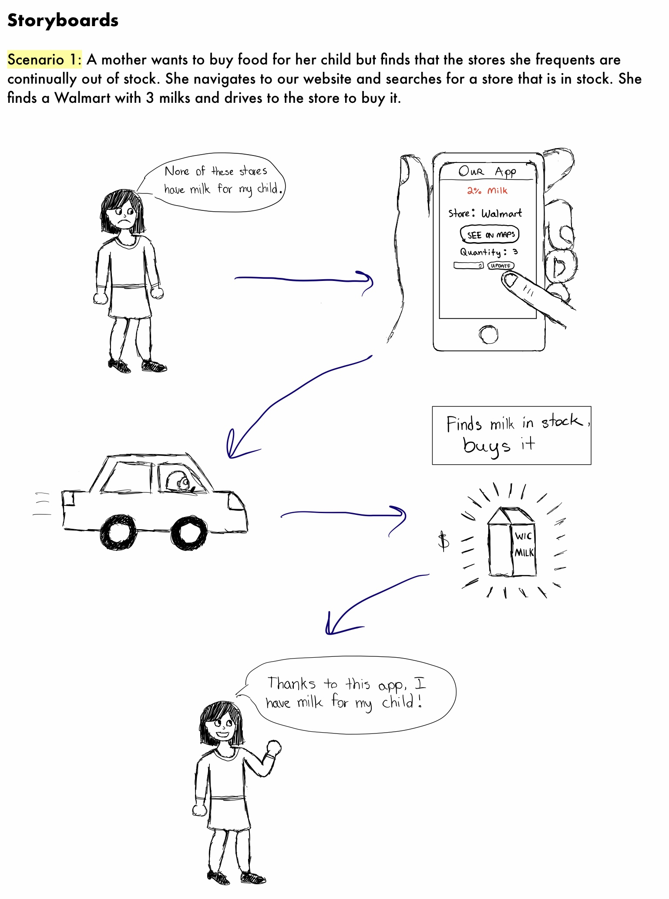

### Scenario 2
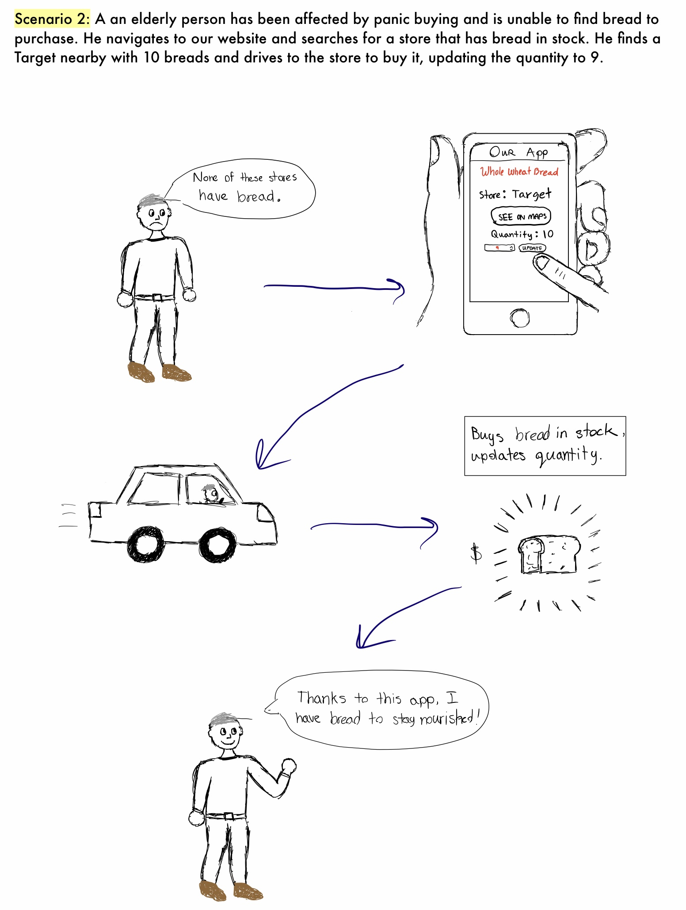

## User Manual

Quick links:
* Link to the live website: https://grocery-assistants.web.app/
* Link to the GitHub: https://github.com/UWcse482a-2020/GroceryAssistants

The following steps detail how one can navigate, test, and otherwise interact with the deployed version of eShoppingAssistant.

1. Visit this website: https://grocery-assistants.web.app/
2. Select allow for your location as indicated below. 
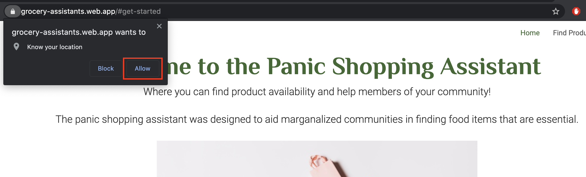
3. Click on the green “Search for a Product” button
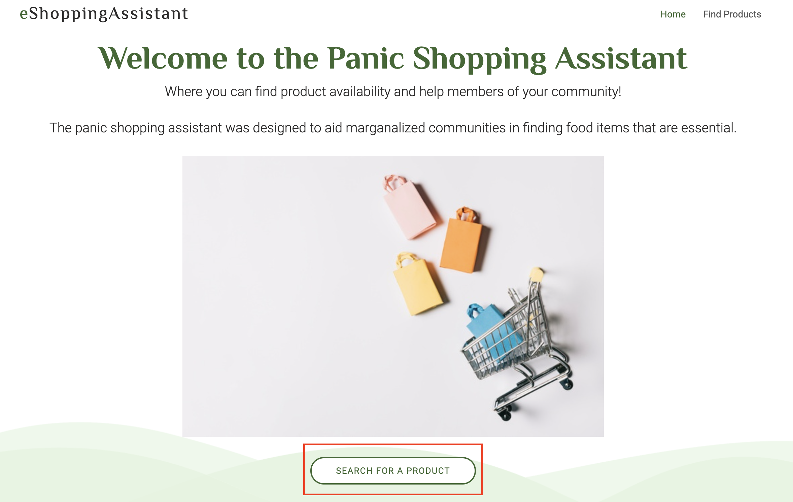
4. Using the search bar, enter the food that you would like to search for.
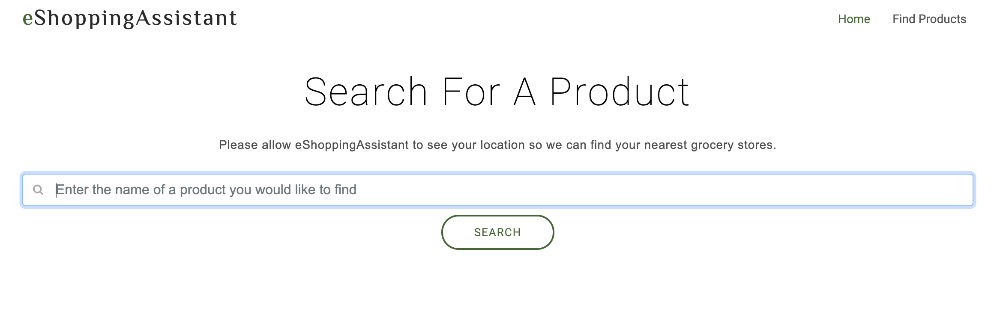
5. Example: type in "Celery", and choose an iterm you are interested in from the drop-down list
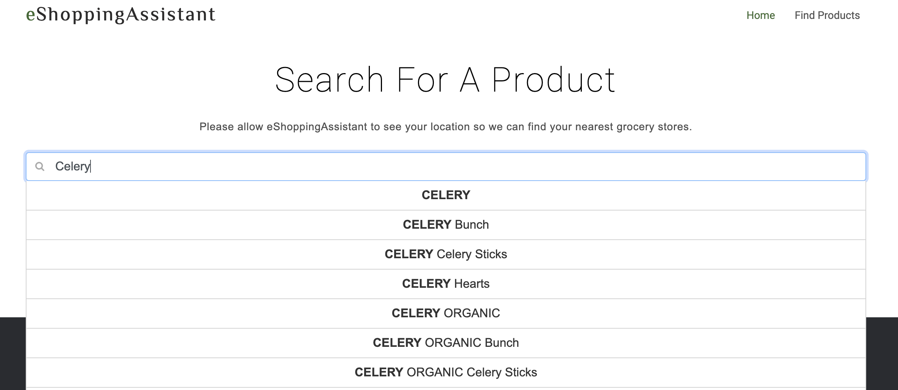
6. After selecting the product, click "Search". And then the search results will show.
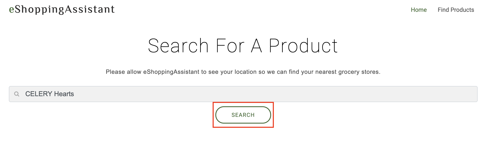
7. If desired, update the quantity of the product you have just searched by first entering the new quantity into the box then selecting “Update”. Next time when you search for the product, the quantity will be updated and stores will be re-ranked for recommendations. 
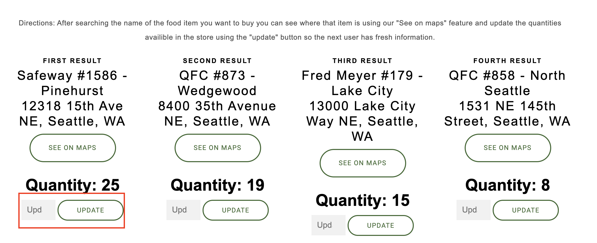
8. At the bottom of screen, a map snippets shows the 4 locations of the recommended stores.
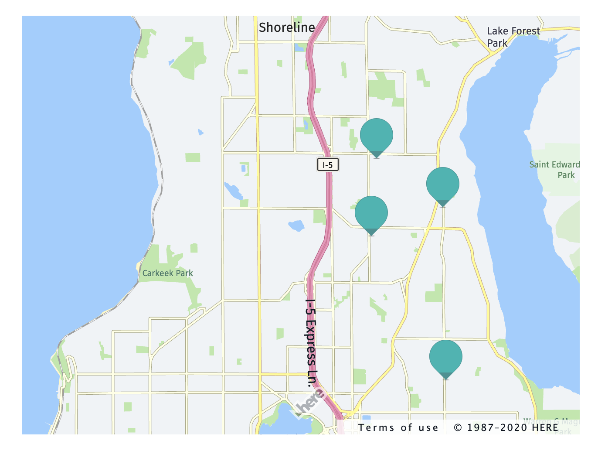

If you search for a product that is not in our database, you will see an error message like this:

If no store was found to be within the 5 km radius from you, you will see an error message like this: 

